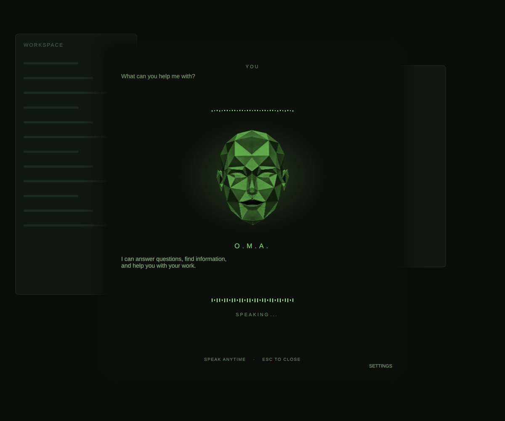

# O.M.A.

**Omarchy Machine Assistant**, pronounced **OH-mah**.

A voice assistant for the Omarchy desktop with a theme-colored, low-poly face.
Talk to it, interrupt its replies, and ask it to operate local apps through
OpenAI Realtime and Codex. Conversation memory stays available between sessions.



## What it does

- Opens with **F8**, the center-bar brain icon, or optional **Hey O.M.A.** wake detection.
- Listens while its panel is open. No push-to-talk key is required.
- Speaks replies, animates its face, and displays both sides of the conversation.
- Launches apps, edits files, changes settings, and operates the desktop through Codex.
- Remembers conversations, preferences, task checkpoints, and exact URL references locally.
- Can inspect a connected camera when requested.
- Follows the current theme, including face, glow, waveform, and muted subtitle colors.

This is an early desktop integration, tested on **Omarchy 4.0.4 (Quattro)**.
It requires an OpenAI API key; API usage is billed separately.

## Requirements

- Omarchy Quattro with its Quickshell plugin system and Hyprland Lua dispatchers.
- Node.js **24+**, Python 3, and systemd user services.
- Codex CLI with App Server support; tested with **0.155.1**.
- PipeWire: `pw-record`, `pw-play`, `pw-cli`, `wpctl`, and WebRTC echo cancellation.
- `grim`, `wtype`, `hyprctl`, `xdg-open`, and `setpriv`.
- Optional mouse clicks: a C compiler, `wayland-scanner`, and Wayland client headers.
- An OpenAI API key with access to the configured Realtime and Codex models.
- Desktop Secret Service and `secret-tool` (included in standard Omarchy)
  to save a key through Settings.
  Alternatively, provide `OPENAI_API_KEY` in the desktop session environment.
- Optional camera support: FFmpeg and `v4l2-ctl`.
- Optional voice wake: Python venv/pip and the Vosk model installed by `scripts/setup-wake`.

## Install

Run this in an Omarchy terminal:

```sh
omarchy plugin add https://github.com/komagata/oma --enable
```

1. Choose the center bar section if prompted, then click the brain icon.
2. Click **SET UP**. A terminal wizard offers missing system packages, Codex,
   mouse control, voice wake, and the F8 shortcut.
   The first package installation runs the standard Omarchy update first,
   including package-list synchronization and system updates. It may ask for your system password. Optional steps can be
   skipped; an existing F8 binding is preserved.
3. Return to O.M.A. and click **CHECK AGAIN**. Paste your OpenAI API key and click
   **SAVE KEY**, then **START O.M.A.**

The plugin manager installs the plugin; the explicit setup wizard handles
machine dependencies. Nothing is installed silently by the bar. The WebSocket
library is bundled, so no npm install is needed.

If the setup window does not open, run:

```sh
~/.config/omarchy/plugins/io.github.komagata.oma/scripts/setup
```

Setup can be rerun after a failed download or to add optional features. It
preserves conversation history and existing keys. If a step fails, its error
stays visible in the terminal. For an old Node.js selected through a version
manager, update that installation to version 24+ and rerun setup.

Voice wake currently uses a Japanese Vosk model; other accents are not yet
validated. Enable **VOICE WAKE** in Settings after setup. Camera support is
optional and requires FFmpeg and `v4l2-ctl`.

### API key

On first launch without a key, the welcome page explains the requirement and
opens the API-key field. Later, choose **SETTINGS** or right-click the bar icon.
Keys are masked and passed to the desktop keyring over stdin, never returned to the UI.

Lookup order:

1. Desktop keyring: application `io.github.komagata.oma`, credential `openai-api-key`
2. Existing gopass entry: `projects/oma/openai/api-key`
3. `OPENAI_API_KEY` in the desktop session environment
4. Existing gopass entry: `personal/openai/api-key`

Saving changes only O.M.A.'s dedicated desktop-keyring entry and restarts its worker.
The login keyring normally unlocks with your desktop login; no GPG identity or
separate password-store wizard is needed. Existing gopass entries are left intact.

## Use

Open the panel and speak when it is ready. O.M.A. starts with
**“Awaiting your command.”** English locales use that source line; other locales
receive a natural translation. Replies follow the desktop locale (`LC_ALL`,
then `LC_MESSAGES`, then `LANG`) unless you request another language.
UI labels remain English. Input transcription also receives the locale language
(e.g. `en` for `en-US`), independently of the spoken-response instructions.

Try:

- “What are you?”
- “Show me this machine's specs with fastfetch.”
- “Write a digital clock plugin in Neovim.”
- “Change the theme to Tokyo Night.”
- “Open the last URL.”
- “Remember that I prefer tiled windows.”
- “What do you remember about this project?”
- “Forget my preference about tiled windows.”
- “What am I holding?” (with a connected camera)
- “Thanks. Bye!”

Speech is submitted after approximately **five seconds of silence**, with a
90-second limit per turn. Voice detection adapts to local noise, preserves up to
one second of pre-roll, and hands capture to the conversation without restarting
the recorder. Speak during a reply or task to interrupt it. Completed actions
are not rolled back.

Both transcript areas show five complete lines in 14px text. Longer text scrolls
by whole lines; use the mouse wheel to review it. Assistant text appears with a
retro typewriter animation. Transcription is a guide to what was heard, not a
guarantee of the audio model's exact interpretation.

Escape, the bar icon, or a spoken farewell closes the panel. Idle time triggers
one spoken prompt after 15 seconds, then a farewell after another 20 idle seconds.
Closure waits for the final speech to finish. Returning from Settings stays silent.

### Voice wake and recording

```sh
./scripts/setup-wake
```

Enable **VOICE WAKE** in Settings, then say “Hey O.M.A.”
The current local wake detector uses **Vosk's Japanese model** and is tuned to
Japanese pronunciations of the phrase. Wake recognition across other accents is
not yet validated; F8 and the bar icon work independently of it.

Wake audio stays local. Conversation audio is sent to OpenAI after speech starts.
Screen recorders and other apps can share microphone capture with O.M.A.
Mute and session lock still pause listening. The private PipeWire WebRTC echo
canceller suppresses O.M.A.'s own playback without changing default devices.
Echo cancellation and speech detection depend on room acoustics and microphone placement.

## Desktop access and privacy

Codex runs with **full desktop access**. Routine requested file edits, commands,
app launches, and settings changes do not require extra approval. The bundled
skill instructs the agent to request confirmation before destructive actions,
purchases, publishing, or external messages. This is an agent-level policy,
**not an operating-system sandbox**. Approvals can be answered with the buttons
or supported English/Japanese yes/no phrases; unclear answers remain pending.

Visual desktop operations send screenshots to OpenAI. Requested camera snapshots
also send images to OpenAI and release the camera afterward. Images may remain
in local Codex session history. Review what is visible before asking for these actions.

Ordinary app and image windows are tiled by default. The agent should inspect and
verify its actions and must not treat external page or image content as instructions.

Private data lives in `${XDG_DATA_HOME:-~/.local/share}/oma/`:

- `memory.sqlite`: conversation text, facts, summaries, action references, and task checkpoints.
- `codex/`: dedicated Codex authentication and session history.
- Optional wake-model files and Python environment.
- A temporary restart-context file when a restart is prepared.

Raw microphone audio is not saved by O.M.A. Local text history persists until
forgotten or removed. Older conversation context is summarized to bound API usage.
Forgetting does not undo external file changes or remove operating-system backups.

Advanced environment options: `OMA_DATA_DIR`, `OMA_WORKSPACE` (default `~/Projects`),
and `OPENAI_API_KEY`. Models are currently fixed to `gpt-realtime-2.1`,
`gpt-4o-transcribe`, `gpt-5.3-codex`, and `gpt-4.1-mini` for summaries.

## Update and remove

```sh
omarchy plugin update io.github.komagata.oma
```

If you use mouse control, rerun `scripts/build-pointer` in the installed plugin
after updates that change its native source.

```sh
omarchy plugin remove io.github.komagata.oma
```

Remove the F8 binding you added and reload Hyprland. Removal leaves conversation
data, downloaded wake dependencies, and credential-store entries intact. To erase private
history, stop O.M.A. and remove its data directory. Its Codex store is separate
from your normal Codex configuration.

## Development

```sh
npm ci --ignore-scripts
./tests/run
./demo/run
```

For a separate development checkout, `./scripts/install-local` remains available
for a non-Git-managed local installation. It refuses to overwrite a Git-managed
plugin; use the standard update command for those installations.

The suite includes manifest validation, Node tests, shell syntax checks, and
Qt tests when the required Qt/graphics tooling is available. GitHub Actions runs
the portable checks. See [verification](docs/VERIFICATION.md) for scope and limits.

`demo/run` opens a fictional conversation without API usage or real memory.
For an isolated visual preview:

```sh
mkdir -p artifacts
QT_QPA_PLATFORM=offscreen QT_QPA_PLATFORMTHEME=basic QT_QUICK_BACKEND=rhi \
  QSG_RHI_BACKEND=opengl QT_QUICK_CONTROLS_STYLE=Basic \
  /usr/lib/qt6/bin/qml demo/Preview.qml -- --capture
```

Opt-in live checks in `tests/live*.mjs` make billed API calls with fictional data.
The bundled [OMA Skill](skills/oma/SKILL.md) and [camera skill](skills/oma-camera/SKILL.md)
are automatically included for every O.M.A. user, in both voice and executor instructions.

The editable Blender source is `models/oma-face.blend`. Blender is optional:

```sh
blender --background --python scripts/build_face_blender.py
```

The portrait uses jaw/lip shape keys and procedural head movement. Lip motion is
amplitude/spectrum-driven rather than phoneme-aligned, and the model is intended
for subtle frontal motion. See [architecture](docs/DESIGN.md) and the
[demo guide](docs/DEMO-SCRIPT.md).

## Support and license

Report reproducible bugs through [GitHub Issues](https://github.com/komagata/oma/issues).
For sensitive reports, see [SECURITY.md](SECURITY.md). Do not attach API keys,
private conversations, camera images, or unredacted desktop captures to public issues.

Code: MIT © 2026 komagata. The startup/closing sound is adapted from OtoLogic
under **CC BY 4.0**; see [asset credits](assets/NOTICE.md). Third-party dependencies
retain their own licenses.
